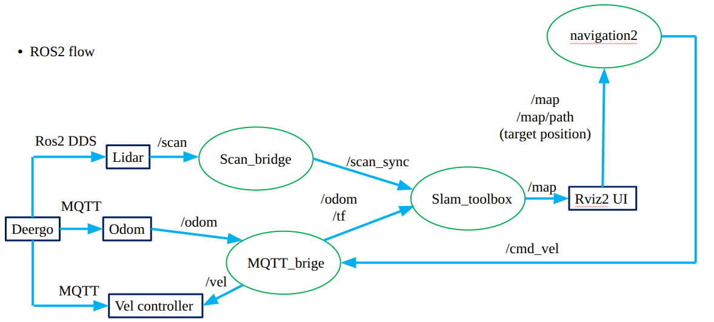

# DeerGo Autonomous Navigation

[繁體中文](README_zh.md) | English

> **Note**: This repository was bootstrapped with the [AGILAB Software Template](https://github.com/AGILAB-NTNU/SoftwareTemplate).

---

## Overview

This project provides a ROS 2 based navigation system for the DeerGo mobile robot.

The system integrates:

- DeerGo MQTT communication
- ROS 2 odometry
- LiDAR data synchronization
- SLAM Toolbox
- Nav2 autonomous navigation
- RViz2 visualization

The main ROS 2 TF structure is:

```text
map
 │
 ▼
odom
 │
 ▼
base_link
 │
 ▼
laser_link
```

The main system flow is shown below:



---

## Installation

### Prerequisites

System environment:

```text
scripts/ros2_env.sh
```


---

### Setup Instructions

#### 1. Clone the repository

```bash
git clone <repository_url>

cd <repository_name>
```

Enter the DeerGo ROS 2 workspace:

```bash
cd deergo_ws
```

All following commands assume that the current directory is:

```text
deergo_ws/
```

---

#### 2. Build the ROS 2 workspace

```bash
colcon build

source install/setup.bash
```

To rebuild only the DeerGo package:

```bash
colcon build \
  --packages-select deergo_mqtt_bridge \
  --symlink-install

source install/setup.bash
```

---

#### 3. Configure Network and ROS 2 Environment

Network and ROS 2 environment setup is integrated into:

```text
scripts/deergo_connect.sh
```

Run:

```bash
source scripts/deergo_connect.sh
```

The script includes:

```bash
sudo ip addr flush dev enp3s0

sudo ip addr add 192.168.158.100/24 dev enp3s0

sudo ip link set enp3s0 up


source /opt/ros/humble/setup.bash

export ROS_DOMAIN_ID=13

export ROS_LOCALHOST_ONLY=0

source install/setup.bash
```

Use `source` instead of directly executing the script so that the ROS 2 environment variables are applied to the current terminal.

---

#### 4. Install pre-commit hooks

Optional but recommended:

```bash
pre-commit install
```

---

## Connection Check

Check Ethernet configuration:

```bash
ip addr show enp3s0
```

Check the DeerGo network connection:

```bash
ping -c 4 192.168.158.200
```

Check the MQTT broker:

```bash
nc -zv 192.168.158.200 1883
```

Check the raw LiDAR topic:

```bash
ros2 topic echo /scan
```

---

## Project Structure

```text
.
├── assets/                     # README figures and diagrams
├── maps/                       # Saved SLAM maps and pose graphs
├── scripts/
│   └── deergo_connect.sh       # Network and ROS 2 environment setup
│
├── src/
│   └── deergo_mqtt_bridge/
│       ├── config/             # SLAM / Nav2 parameter files
│       ├── launch/             # ROS 2 launch files
│       ├── rviz/               # RViz2 configuration
│       └── deergo_mqtt_bridge/ # ROS 2 Python nodes
│
├── build/                      # ROS 2 build files
├── install/                    # ROS 2 installed workspace
└── log/                        # ROS 2 build and runtime logs
```

---

## Usage

### First-Time Mapping

Start DeerGo in SLAM mapping mode:

```bash
ros2 launch deergo_mqtt_bridge slam_rviz.launch.py \
  load_map:=false
```

The launch file starts:

```text
mqtt_bridge
scan_bridge
base_link -> laser_link TF
slam_toolbox
Nav2
RViz2
```

---

### Localization With an Existing Map

If a serialized SLAM map already exists in:

```text
maps/deergo.data
maps/deergo.posegraph
```

start localization mode with:

```bash
ros2 launch deergo_mqtt_bridge slam_rviz.launch.py \
  load_map:=true
```

The localization configuration loads:

```text
maps/deergo
```

without specifying the `.data` or `.posegraph` extension.

---

## DeerGo Motion Control

### Enable Velocity Control

Before sending Nav2 velocity commands to DeerGo:

```bash
mosquitto_pub \
  -h 192.168.158.200 \
  -p 1883 \
  -t 'Puffer/DeerGo_001/motion_enable' \
  -m '0'
```

After enabling motion control, use:

```text
Nav2 Goal
```

in RViz2 to select a navigation target.

---

### Disable Velocity Control

Disable DeerGo motion:

```bash
mosquitto_pub \
  -h 192.168.158.200 \
  -p 1883 \
  -t 'Puffer/DeerGo_001/motion_disable' \
  -m '0'
```

---

## Map Management

### Save Occupancy Map

Create the map directory if necessary:

```bash
mkdir -p maps
```

Save the current occupancy map:

```bash
ros2 service call /slam_toolbox/save_map \
  slam_toolbox/srv/SaveMap \
  "{name: {data: 'maps/deergo_map'}}"
```

Output:

```text
maps/deergo_map.pgm
maps/deergo_map.yaml
```

These files contain the 2D occupancy map.

---

### Save Serialized SLAM Map

To use:

```bash
load_map:=true
```

SLAM Toolbox also requires the serialized pose graph.

Save it with:

```bash
ros2 service call /slam_toolbox/serialize_map \
  slam_toolbox/srv/SerializePoseGraph \
  "{filename: 'maps/deergo'}"
```

Output:

```text
maps/deergo.data
maps/deergo.posegraph
```

The difference between the two map formats is:

```text
save_map
├── deergo_map.pgm
└── deergo_map.yaml
    -> 2D occupancy map

serialize_map
├── deergo.data
└── deergo.posegraph
    -> SLAM Toolbox pose graph
    -> Required for load_map:=true
```

---

### Pause SLAM

Pause new SLAM measurements:

```bash
ros2 service call \
  /slam_toolbox/pause_new_measurements \
  slam_toolbox/srv/Pause \
  "{}"
```

---

## Debugging

### Check ROS 2 Topics

```bash
ros2 topic list
```

---

### Check Odometry

```bash
ros2 topic echo /odom
```

---

### Check Raw LiDAR

```bash
ros2 topic echo /scan
```

---

### Check Synchronized LiDAR

```bash
ros2 topic echo /scan_sync
```

Check the LiDAR publishing frequency:

```bash
ros2 topic hz /scan_sync
```

---

### Check Nav2 Velocity

```bash
ros2 topic echo /cmd_vel
```

---

### Check MQTT Velocity

```bash
mosquitto_sub \
  -h 192.168.158.200 \
  -p 1883 \
  -t 'Puffer/DeerGo_001/vel' \
  -v
```

---

### Check TF

Check:

```text
map -> odom
```

```bash
ros2 run tf2_ros tf2_echo map odom
```

Check:

```text
odom -> base_link
```

```bash
ros2 run tf2_ros tf2_echo odom base_link
```

Check:

```text
base_link -> laser_link
```

```bash
ros2 run tf2_ros tf2_echo base_link laser_link
```

---

### Check Nav2 Local Costmap

Check the local costmap publishing frequency:

```bash
ros2 topic hz /local_costmap/costmap
```

Check lifecycle states:

```bash
ros2 lifecycle get /local_costmap/local_costmap

ros2 lifecycle get /controller_server
```

The normal state is:

```text
active [3]
```

---

## Quick Start

After restarting the computer, enter the workspace:

```bash
cd ~/deergo_ws
```

Load the network and ROS 2 environment:

```bash
source scripts/deergo_connect.sh
```

### Mapping

```bash
ros2 launch deergo_mqtt_bridge slam_rviz.launch.py \
  load_map:=false
```

### Localization

```bash
ros2 launch deergo_mqtt_bridge slam_rviz.launch.py \
  load_map:=true
```

### Enable Robot Motion

```bash
mosquitto_pub \
  -h 192.168.158.200 \
  -p 1883 \
  -t 'Puffer/DeerGo_001/motion_enable' \
  -m '0'
```

### Stop Robot Motion

```bash
mosquitto_pub \
  -h 192.168.158.200 \
  -p 1883 \
  -t 'Puffer/DeerGo_001/motion_disable' \
  -m '0'
```

---

## Contributing

This project follows the unified AGILAB development workflow.

Before contributing, please refer to the [AGILAB Software Lab Guide](https://agilab-ntnu.github.io/AGILAB_Software_Lab_Guide/en/contributing/) for branching strategies and coding standards.

---

## Citation

If you use this work in your research, please cite it as follows:

```bibtex
@article{author_year_deergo,
  author  = {Author, First and Author, Second},
  title   = {DeerGo Autonomous Navigation},
  journal = {Journal or Conference Name},
  year    = {2026},
  url     = {<repository_url>}
}
```

---

## License

This project is licensed under the Apache License 2.0.
